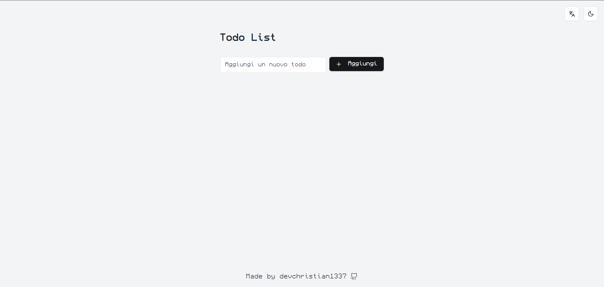

# 🗒️ Todo List App

Un'applicazione moderna per la gestione delle attività costruita con Next.js 15, TypeScript e Framer Motion. Presenta un'interfaccia pulita con supporto per la modalità scura, opzioni multilingua e animazioni fluide.



## ✨ Caratteristiche

📝 Gestione completa delle attività (aggiungi, elimina, completa)  
🌍 Supporto multilingua (Inglese, Italiano, Spagnolo, Tedesco, Francese)  
🌓 Modalità Chiara/Scura integrata  
📱 Design completamente responsive  
✨ Animazioni fluide con Framer Motion  
🔔 Notifiche toast per le azioni  
🎨 Interfaccia moderna con TailwindCSS  
📱 Menu hamburger per dispositivi mobili  
💾 Persistenza dello stato dell'interfaccia  
🚀 Partial Prerendering (Next.js 15)  
🔒 Server Actions ottimizzate  
🎯 Typed Routes

## 🛠️ Stack Tecnologico

- Next.js 15
- TypeScript
- Framer Motion
- TailwindCSS
- Radix UI
- Sonner (notifiche toast)
- Country Flag Icons
- Lucide React
- Hamburger React

## 🚀 Installazione

1. Clona il repository
2. Installa le dipendenze:
```bash
npm install
```

3. Avvia il server di sviluppo:
```bash
npm run dev
```

4. Apri [http://localhost:3000](http://localhost:3000) nel tuo browser.

## 📦 Script Disponibili

- `npm run dev` - Avvia il server di sviluppo
- `npm run build` - Crea la build di produzione
- `npm run start` - Avvia il server di produzione
- `npm run lint` - Esegue il linting del codice

## 👤 Autore

**devchristian1337**

* Github: [@devchristian1337](https://github.com/devchristian1337)

## ⭐️ Mostra il tuo supporto

Dai una ⭐️ se questo progetto ti è stato utile!